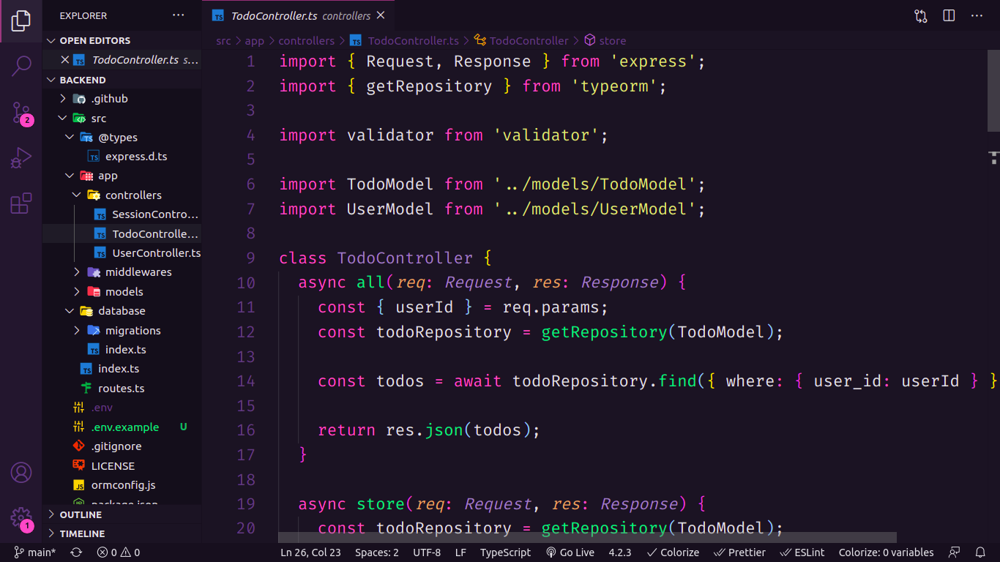

<p align="center">
  <h3 align="center">Api for the Todo-List-React repo</h3>

  <p align="center">
    This is the api for the todo-list-react project.
    <br />
    <a href="https://github.com/lucfersan/api-todo-list-react"><strong>Explore the docs »</strong></a>
    <br />
    <br />
    ·
    <a href="https://github.com/lucfersan/api-todo-list-react/issues">Report Bug</a>
    ·
    <a href="https://github.com/lucfersan/api-todo-list-react/issues">Request Feature</a>
  </p>
</p>

## About The Project



I wanted to build an API for that **[Todos-Repo](https://github.com/lucfersan/todo-list-react)** because some functionalities were not that great, and I couldn't find a way to use local storage properly, so I developed this simple but efficient backend.

In this project, I decided to use typeorm, which I find fantastic, because of its simple way to configure, and also because it has a lot of power when combined with typescript.

And to give the code a pattern, I used the VsCode prettier extension.

I used docker to create the containers for the database.

### Built With

- [Typescript](https://www.typescriptlang.org/)
- [Express](https://www.npmjs.com/package/express)
- [Prettier](https://prettier.io/)
- [Typeorm](https://typeorm.io/#/)
- [Dotenv](https://www.npmjs.com/package/dotenv)
- [JsonWebToken](https://www.npmjs.com/package/jsonwebtoken)
- [Bcrypt](https://www.npmjs.com/package/bcrypt)
- [Validator](https://www.npmjs.com/package/validator)

### Installation

1. Clone the repo
   ```sh
   git clone https://github.com/lucfersan/api-todo-list-react
   ```
2. Install NPM packages
   ```sh
   yarn
   ```
3. Create a docker container
   ```sh
   docker run --name todosapp -e POSTGRES_PASSWORD=docker -p 5432:5432 -d postgres
   ```
4. Create database named: todosapp
5. Follow the .env.example to customize your own environment variables

## Contributing

Contributions are what make the open source community such an amazing place to be learn, inspire, and create. Any contributions you make are **greatly appreciated**.

1. Fork the Project
2. Create your Feature Branch (`git checkout -b feature/AmazingFeature`)
3. Commit your Changes (`git commit -m 'Add some AmazingFeature'`)
4. Push to the Branch (`git push origin feature/AmazingFeature`)
5. Open a Pull Request

## License

Distributed under the MIT License. See `LICENSE` for more information.

## Contact

Lucas Fernandes - fernandes.lucas11@outlook.com
